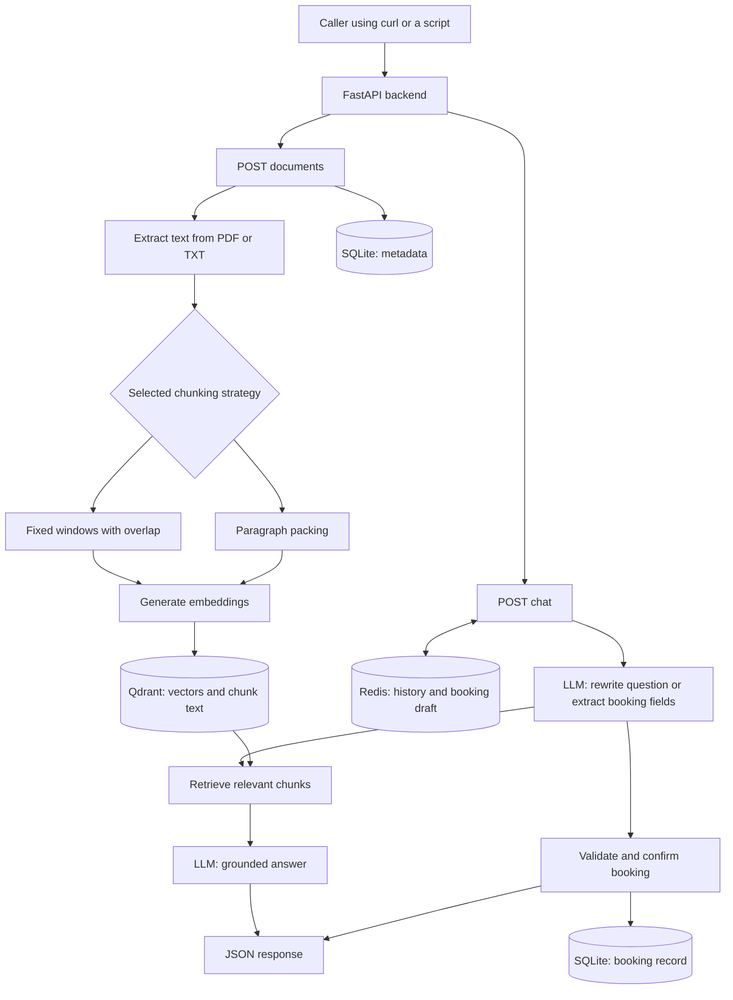
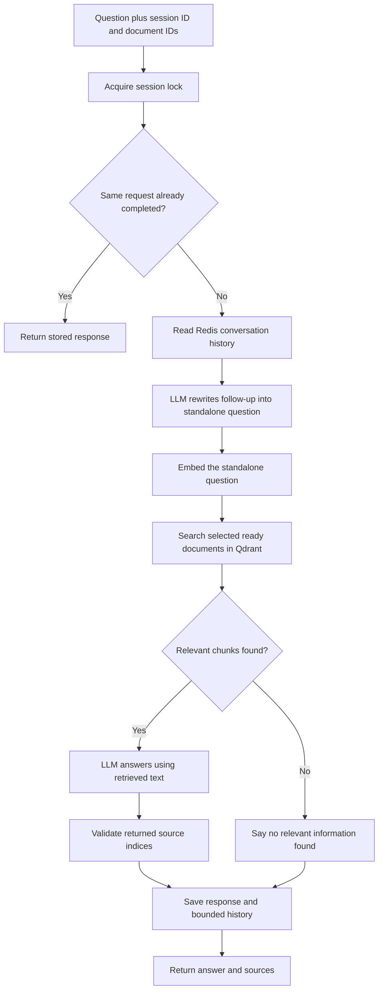
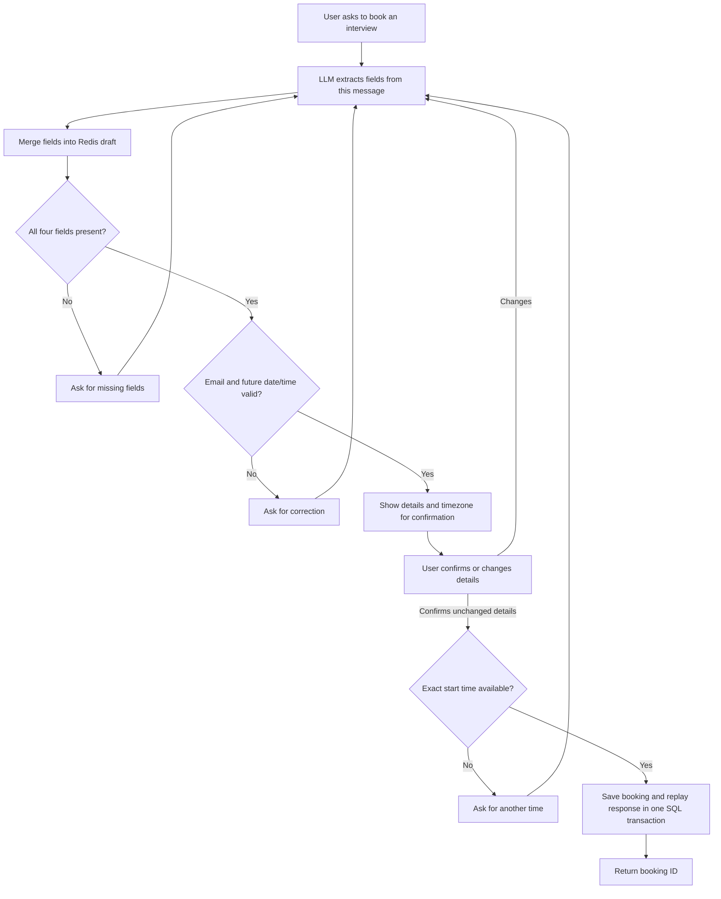

# Understand the assignment and explain your solution

## 1. What HR is asking, in simple words

Build the server behind a document chatbot. You do not need a website or mobile app.

**The first API teaches the system where to find information.** A caller uploads a PDF or text file. The server reads it, breaks the text into smaller pieces, converts each piece into numbers representing meaning, and stores those numbers for searching.

**The second API talks to the user.** It remembers earlier messages, finds relevant pieces of the uploaded documents and uses an LLM to write an answer. Through the same conversation, it can collect a person's name, email, interview date and time and save a booking.

The two APIs are `POST /api/v1/documents` and `POST /api/v1/chat`. A booking is part of the chat API, so we did not add a third business endpoint.

## 2. What the email means beyond the code

The email is a hiring assignment, not an offer. HR asks you to submit a GitHub link by replying to the email within 48 hours. If the displayed receipt time is October 6, 2026 at 11:15 AM, the corresponding 48-hour point is **October 8, 2026 at 11:15 AM in that same displayed timezone**. The pasted email does not establish the sender's timezone independently.

HR also asks candidates to undertake the task only if they can commit to at least one year and accept a two-month notice period if selected. Only you can decide whether those conditions work for you. The backend does not make that commitment on your behalf.

## 3. The words you need to understand

| Term | Simple explanation | In this project |
| --- | --- | --- |
| Backend | The server doing the work behind an application | FastAPI |
| REST API | A URL another program calls with an HTTP request | Two POST endpoints |
| Chunk | A small piece of a larger document | Up to 1000 characters by default |
| Overlap | Repeating a small part between adjacent chunks | Default 100 characters for fixed chunks |
| Embedding | A list of numbers that represents text meaning | OpenAI embedding vector |
| Vector database | A database that finds vectors with similar meaning | Qdrant |
| Retrieval | Finding document pieces relevant to a question | Qdrant cosine search |
| RAG | Retrieve useful text, then give it to an LLM to answer | Custom service code |
| LLM | The model interpreting language and writing responses | Configurable OpenAI model |
| Redis | Fast temporary storage | Conversation history and draft booking |
| Metadata | Information describing a document or chunk | Filename, strategy, checksum, timestamps |
| SQL database | Durable records in structured tables | SQLite |
| Validation | Checking whether data is acceptable | Pydantic and date/time rules |
| Idempotency | Retrying the same action without doing it twice | `request_id` replay records |

An embedding is not a summary you can read and is not a saved LLM conversation. It is a vector used to compare meaning. The same embedding model must be used for documents and questions.

## 4. The complete flow

## 5. API 1 step by step

1. Authenticate the request using the shared API key.
2. Accept a PDF or TXT file and the selected chunking strategy.
3. Check the file size and format. Extract UTF-8 text or text from PDF pages.
4. Reject empty text, unreadable files or a scanned PDF without a text layer.
5. Split text using the requested strategy.
6. Create a SQL document record with `pending` status.
7. Generate an embedding for every chunk.
8. Store each vector with its chunk text, document ID, filename and chunk index in Qdrant.
9. Save chunk metadata and mark the document `ready` in SQL.
10. Return its ID and chunk count. Only ready documents may be searched.

**Why two chunking strategies?** Documents have different structures. A long unstructured text works with fixed windows. A document organized into short paragraphs often benefits from keeping paragraphs together.

For a 1000-character size and 100-character overlap, fixed chunks cover characters 0–999, 900–1899, and so on. The repeated 100 characters help preserve context at boundaries. We do not create a redundant final chunk containing only overlap.

Paragraph chunking packs complete paragraphs up to the limit. A paragraph longer than the limit is split into bounded windows. Paragraph chunks have no overlap in this implementation. These are character-based strategies, not token-based or semantic chunkers.

## 6. API 2: how multi-turn RAG works

Example:

- User: “What skills does the internship need?”
- Assistant: “The sample document mentions Python, REST APIs, embeddings and vector databases.”
- User: “Tell me more about those.”

The phrase “those” does not contain the original subject. The planner sees recent messages from Redis and rewrites the follow-up as a standalone question about the internship skills. That complete question is embedded and searched. The answer model receives the rewritten question and the retrieved text.

**Why not only send chat history to the answer model?** History helps interpret the question, but retrieval must also use the resolved meaning. Otherwise the system may search for “those” and retrieve irrelevant text.

**What makes this custom RAG?** `services.py` explicitly calls planning, embeddings, Qdrant search and answer generation. There is no `RetrievalQAChain` or other prebuilt retrieval pipeline.

## 7. API 2: how interview booking works

The LLM recognizes phrases such as “I would like an interview” and extracts fields into a strict JSON structure. The backend merges only supplied fields into the existing draft. It then checks the email and date/time using normal code.

The backend, rather than the LLM, decides whether to save. A model saying “booked” does not create a record. Saving occurs only after the application has a valid complete draft and receives confirmation without changes. If the user changes the time while confirming, the updated details must be confirmed again.

Dates such as “tomorrow” are interpreted using the configured local time. Ambiguous expressions such as “at 5” are not supposed to be guessed; exact dates and 24-hour times are best for demos. Natural-language extraction still needs live evaluation.

## 8. Why three kinds of storage?

| Storage | What it keeps | Why |
| --- | --- | --- |
| Qdrant | Embedding vectors and source chunks | Similarity search |
| Redis | Recent chat messages and unfinished booking draft | Fast conversation state with expiration |
| SQLite | Document/chunk metadata, confirmed bookings and replay records | Durable structured records and transactions |

One database could potentially implement more than one role, but HR explicitly requires a permitted vector database, Redis memory and SQL/NoSQL metadata. The selected tools satisfy those requirements directly.

## 9. Steps followed to complete the implementation

1. Converted each HR requirement into a concrete feature and checked prohibited tools.
2. Chose FastAPI, Qdrant, Redis and SQLite and defined exactly two API contracts.
3. Created separate modules for configuration, schemas, text processing, persistence and orchestration.
4. Implemented extraction and both deterministic chunking strategies.
5. Added embedding generation and Qdrant insertion with document-specific payloads.
6. Added SQL metadata and readiness states to keep failed ingestion out of retrieval.
7. Added Redis conversation state, bounded history, expiration and a session lock.
8. Built the custom retrieve-and-generate path with follow-up rewriting and sources.
9. Built the LLM-assisted booking draft, deterministic validation and confirmation flow.
10. Added request replay and atomic SQL booking/response persistence for safe retries.
11. Added automated tests, strict type checking, formatting and CI configuration.
12. Prepared Docker setup, example files, live demo, architecture notes and this guide.

Automated test results and limitations are recorded separately. A complete live demonstration still requires configured model credentials and running Redis/Qdrant services. The submission repository is https://github.com/vkaashkrsah/fastapi-rag-system.

## 10. A short explanation to practice

“I built a FastAPI backend with two endpoints. The document endpoint accepts PDF and text files, extracts text, splits it using fixed overlapping chunks or paragraph chunks, generates embeddings and saves them in Qdrant. SQLite stores document and chunk metadata.

“The chat endpoint uses Redis to keep conversation history. For a follow-up question, an LLM rewrites it into a standalone query. My code embeds that query, retrieves matching chunks from Qdrant and asks the LLM to answer using those chunks. The response includes source metadata.

“The same chat endpoint can collect interview booking details over several messages. The LLM extracts fields, and the backend validates the values and asks for confirmation. It stores confirmed bookings in SQLite. Request IDs let the client retry without creating duplicate bookings.

“I separated the API layer, models, database access and AI calls, and tested both normal and failure paths. I did not use a frontend, FAISS, Chroma or RetrievalQAChain.”

Use this as a practice outline. Explain only the parts you understand and distinguish what you ran locally from what is covered by test doubles. If asked about AI assistance, describe it honestly.

## 11. Likely interview questions

**Why use RAG instead of fine-tuning?**
RAG can answer from newly uploaded documents without retraining a model. It also lets us return the source chunks. This assignment needs document lookup, not learning a new model behavior through training.

**Why overlap?**
A fact can straddle a fixed boundary. Repeating a small region gives both neighboring chunks some shared context, at the cost of more storage and embedding work.

**What is cosine similarity?**
It compares the direction of two vectors. Similar directions indicate more similar representations. Qdrant ranks the document vectors against the question vector. Similarity is not proof that a passage contains the answer.

**Why not trust the LLM to validate bookings?**
A model can output an invalid email or a past date. Deterministic validation catches these errors consistently. Structured JSON guarantees a useful shape, not that every value is correct.

**How do you prevent hallucinations?**
I retrieve relevant text, instruct the model to answer only from it, return real sources and use a fallback when evidence is missing or citations are invalid. These measures reduce hallucinations; they do not eliminate them. A next step is evaluation with questions whose correct answers are known.

**What if Qdrant fails halfway through upload?**
The SQL record is marked failed and the code attempts to delete partial vectors. Search requires ready SQL records, so a failed document cannot be requested through the chat API. Crashes still need a reconciliation job at production scale.

**What if Redis fails after a booking is saved?**
The booking and replay response are committed together in SQL. Retrying with the same request ID retrieves the committed response and refreshes Redis. There is a regression test for this case.

**What if two people choose the same start time?**
A unique SQL constraint allows only one booking for that exact timestamp. The losing request gets a message asking for another time. This does not implement interval scheduling or multiple interviewers.

**How would you scale it?**
Move ingestion to a job queue, use PostgreSQL and migrations, add authentication with document ownership, stronger operational monitoring and evaluation, and tune Qdrant indexes and retrieval quality. Those would be extensions beyond this assignment.

## 12. Your demo checklist

1. Explain the two APIs and the three storage roles.
2. Start the stack and show its logs.
3. Upload the sample TXT with `fixed` and PDF with `paragraph`.
4. Ask a question about the sample and show its source chunks.
5. Ask a follow-up using the same session ID.
6. Ask something unsupported and show the fallback response.
7. Give booking details in several turns; show validation and confirmation.
8. Confirm the booking and show the ID.
9. Replay the same request ID and show that the response is unchanged.
10. Show the automated test results and openly explain the scope limits.
